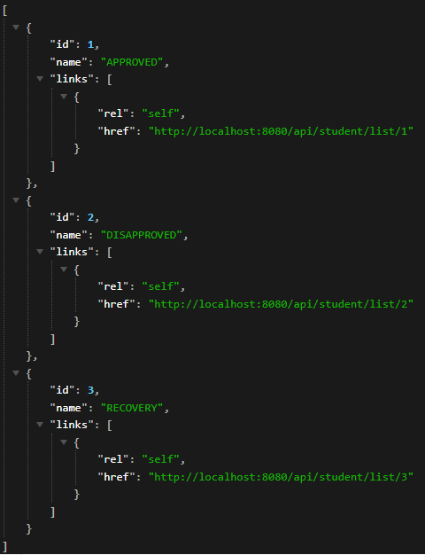

# api-students-spring
It's the first time I've done a project to receive a Certificate while I'm part of Ralf Lima's member ships, thank you Ralf Lima... aka it is a simple student project that I implementing some new rescources

Students 

Student List (APPROVED , DISAPPROVED , RECOVERY)
